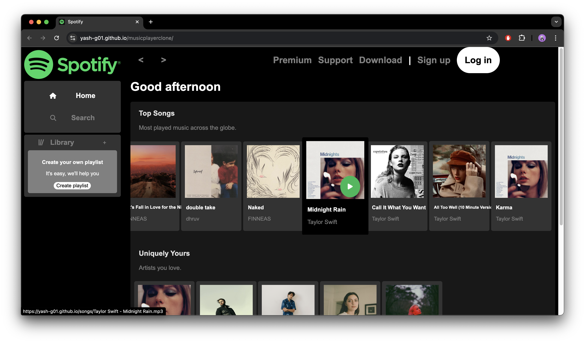
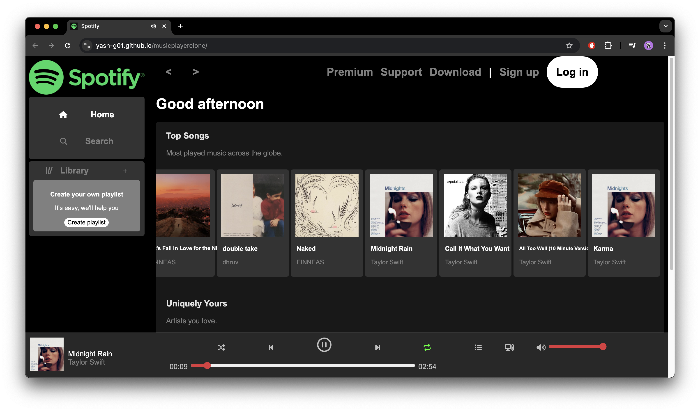

# Spotify - Music Player Clone

Live Demo - https://yash-g01.github.io/musicplayerclone/

* This website is not responsive and should be best viewed on a computer screen.

## Functions

#### Modes :
* Repeat mode - Repeats the song endlessly untill you turn it off.
* Shuffle - Shuffles the playlists. If turned off, it will play the music in order of the songs listed on the page (left to right).

#### Other Functions :
* progressive drag progress bar on song timeline.
* sound range slider
* current time of the song is updated per second.

#### Small Details :
* Greeting message. It will change depending on the time of the day.
* When clicked on play button on the Artists Playlists it will only play the songs of that particular Artist.

## Screenshots

    

    

